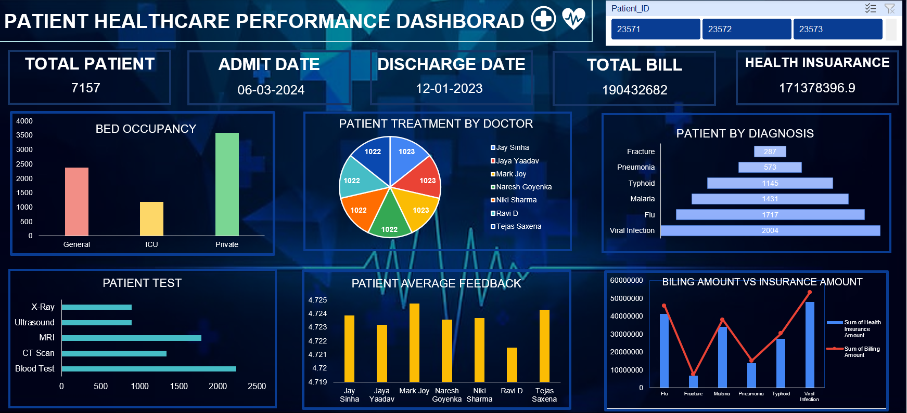

# Patient Healthcare Performance Dashboard (Excel)

An **interactive Healthcare Analytics Dashboard** built in **Microsoft Excel** to visualize and analyze patient data.  
This project demonstrates **data cleaning, pivot tables, pivot charts, and slicer-based interactivity** for healthcare insights.  

It’s a great example of how **Excel can be used for data analytics and visualization** in real-world scenarios.

---

## 🖼 Dashboard Preview

---

##  Key Features
✔️ Patient admissions & discharge analysis  
✔️ Bed occupancy rates (General, ICU, Private)  
✔️ Treatment analysis by doctor & diagnosis  
✔️ Patient test breakdown (X-Ray, MRI, CT Scan, etc.)  
✔️ Billing vs Insurance cost comparison  
✔️ Doctor-wise patient feedback scores  
✔️ Interactive filters with **Excel Slicers**  

---

##  Use Cases
- 📌 **Healthcare Management** → Monitor hospital operations  
- 📌 **Data Analytics Portfolio Project** → Showcase Excel skills  
- 📌 **Recruiter/Interview Use** → Highlight dashboard-building & visualization skills  
- 📌 **Learning Resource** → Beginner-friendly project for practicing **Excel dashboards**  

---

##  Tools & Techniques
- **Microsoft Excel (Pivot Tables, Pivot Charts, Slicers)**  
- **Data Cleaning & Transformation**  
- **Data Visualization Techniques**  
- **KPI Tracking**  

---

##  How to Use
1. Open the file: Open the provided dashboard file in Microsoft Excel or a compatible spreadsheet program.
2. Navigate to the Dashboard Sheet: Ensure you are on the "Dashboard" sheet. All other sheets (containing raw data and pivot tables) are hidden to provide a clean user interface.
3. Analyze KPIs: The top section of the dashboard shows key metrics at a glance.
4. Explore the Charts: Interact with the various charts to see data trends and distributions.
5. Filter Data: Use the filter and slicer controls to drill down into specific data points (e.g., filter by a specific doctor or diagnosis). This allows for a more detailed analysis.
  
---

## Insights from Dashboard
- Private Ward has the highest **bed occupancy**  
- **Viral Infection** is the most common diagnosis  
- **MRI** and **Blood Tests** are the top performed tests  
- Insurance coverage is **lower than billing amounts** for many patients  
- Doctor feedback ratings help measure **service quality**  

---

##  Author
Created by **Ishita Sharma** as part of a **Data Analytics Portfolio Project**.  
If you found this helpful, don’t forget to ⭐ the repo!  

---
